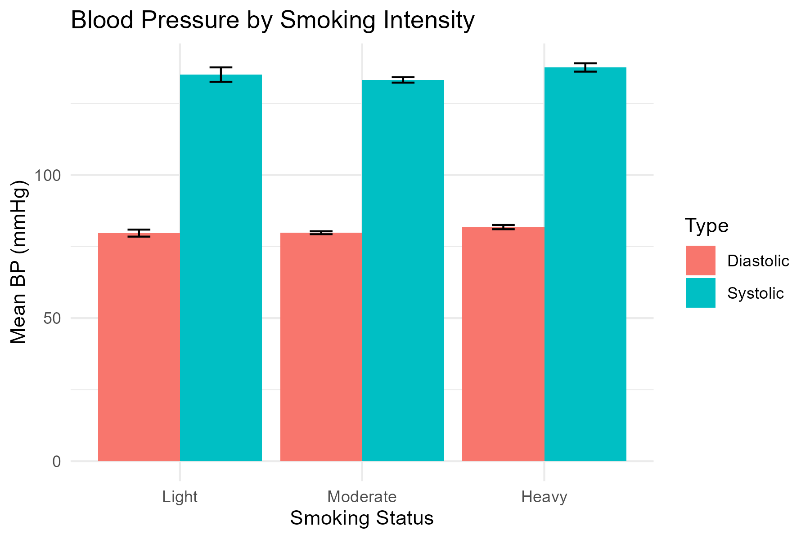
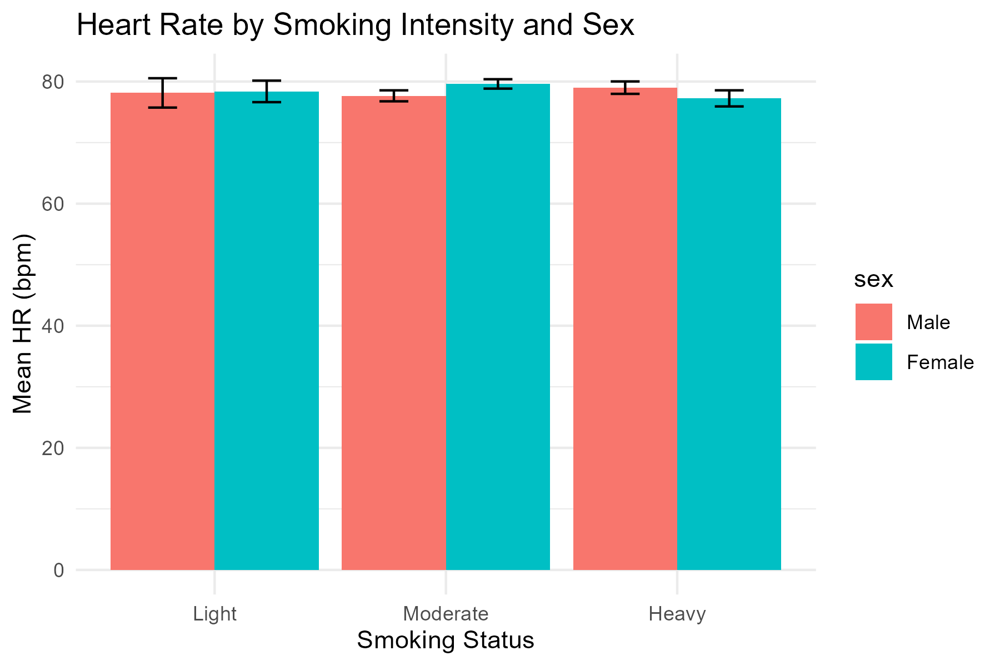

# Impact of Tobacco on Blood Pressure & Heart Rate

This repository contains my undergraduate psychology research project analyzing the impact of tobacco use on blood pressure (BP) and heart rate (HR). The project demonstrates reproducible data analysis in R, with a focus on clear communication of results for both technical and non‑technical audiences.

---

## 📂 Repository Structure
- `data/dataset.csv` — raw dataset used in the analysis  
- `analysis/analysis.Rmd` — R Markdown file with full analysis and visualizations  
- `analysis/analysis.html` — knitted HTML report (viewable without R)  
- `figures/` — exported plots for quick reference  

---

## 📊 Results Preview

Here are a few key findings from the analysis:

  
*Mean systolic and diastolic BP by smoking status.*

  
*Average heart rate differences by sex.*

---

## 🧰 Methods Overview
The dataset was first cleaned by selecting relevant cardiovascular and demographic variables (systolic/diastolic blood pressure, heart rate, sex, age, smoking behavior, and hypertension history). Participants who reported smoking at least one cigarette per day were retained for analysis. Smokers were then categorized into three intensity groups — *Light* (≤5 cigarettes/day), *Moderate* (6–20/day), and *Heavy* (≥21/day). Key categorical variables (sex, hypertension history, smoking group) were converted into factors to ensure proper statistical handling. Descriptive statistics were computed for each group, followed by ANOVA tests and post‑hoc comparisons to evaluate differences in blood pressure and heart rate across smoking intensity and sex. Visualizations were generated with **ggplot2** to clearly communicate group differences.

---

## 🔎 Full Report
For the complete analysis, including descriptive statistics, ANOVAs, and discussion:

👉 [View the full HTML report](analysis/analysis.html)

---

## 🛠️ Reproducibility
To reproduce the analysis locally:

```r
# Install required packages
install.packages(c("tidyverse", "ggplot2"))

# Render the report
rmarkdown::render("analysis/analysis.Rmd")

```

---

## ✨ Skills Demonstrated
- Data wrangling and cleaning in R  
- Statistical testing (ANOVA, t‑tests)  
- Data visualization with ggplot2  
- Reproducible research practices  
- Clear communication of technical results  